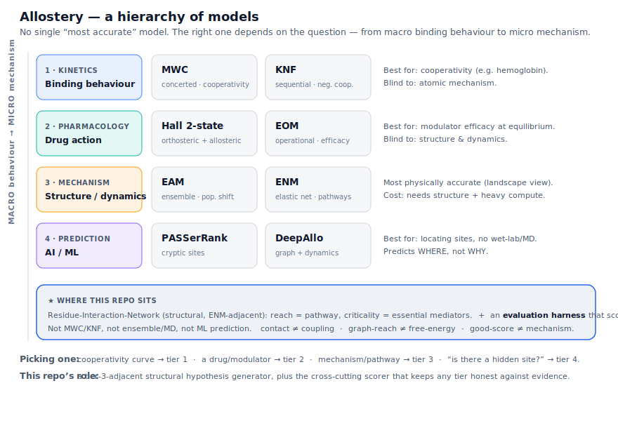

<!-- SPDX-License-Identifier: AGPL-3.0-only -->
# weltwerk/allostery — allosteric mapping as causal reach

Allostery is regulation **at a distance**: an effector binds one site (the *allosteric* site) and changes
activity at a different, distant site (the *active* site). The signal travels through the protein's internal
coupling. Model the protein as a **residue interaction network** — residues are nodes, contacts/couplings
are edges — and the question "which residues carry the signal?" becomes Weltwerk's central object:
**Potential ⊇ Actual** over a directed graph.

The field's vocabulary maps onto the project's verified primitives:

| Allostery | Weltwerk |
|---|---|
| perturb the allosteric site | **reach** over the coupling graph (the signal wavefront) |
| allosteric pathway | shortest `allo → active` path |
| essential mediator residue (mutation uncouples; drug target) | **criticality / SPOF** — its knockout disconnects `allo` from `active` |
| redundant residue | off the only path, or has a bypass — knockout leaves coupling intact |
| residues the signal never touches | the `Potential ⊇ Actual` gap (a strict subset is reached) |

## Files

| File | Role | Grade |
|---|---|---|
| `allostery.py` | protein as a residue coupling graph (toy topology); `propagate` / `pathway` / `mediators` / knockout | MEASURED (7/7) |
| `allostery.html` | interactive viewer (perturb → animate the wavefront; click a residue to mutate it) | IMPLEMENTED |
| `pdb_rin.py` | **real PDB → residue interaction network** (Cβ contact map, no Biopython) | MEASURED |
| `rin_analysis.py` | established analyses (Brandes betweenness, reach) + **Potential-vs-Actual flow** | MEASURED |
| `eval_harness.py` | **the framework: score any predictor vs experimental gold** (precision/recall/F1/AUC + null & degree baselines) | MEASURED |
| `test_rin_pipeline.py` | 8 proofs across parse → analyses → evaluation | MEASURED (8/8) |

## The model landscape (where this sits)



There is no single "most accurate" allosteric model — the field is a **hierarchy sorted by the question**:
binding kinetics (MWC/KNF), pharmacology (Hall/EOM), mechanism & dynamics (Ensemble/EAM, ENM), and AI site
prediction (PASSerRank/DeepAllo). This repo is a **tier-3-adjacent structural method** (a residue interaction
network) **plus** a cross-cutting **evaluation harness** that scores *any* of those against evidence. It is
not MWC/KNF, not ensemble/MD, not an ML predictor.

## Phase 17 — a reproducible framework for *evaluating* allostery hypotheses (not improving prediction)

This is the honest, research-grade step, and the framing matters: **it is a reproducible framework for
evaluating graph-based allostery hypotheses against experimental evidence — it does NOT claim a better
predictor.** New predictors come and go; a transparent scorer with baselines lasts. Pipeline, in priority
order:

1. **`pdb_rin.py`** — parse a *real* `.pdb` into a residue interaction network (Cβ contacts ≤ 8 Å, seq-sep ≥ 2).
   Standard RIN construction; no novelty claimed. `contact ≠ coupling`.
2. **`rin_analysis.py`** — turn the RIN into per-residue *hypothesis scores* with **established** measures
   (Brandes betweenness, reach), plus the project's `Potential ⊇ Actual` split: a perturbation *reaches* most
   of the protein (Potential) but an attenuating signal is *carried* by a sparse set (Actual). `reachable ≠ carrying`.
3. **`eval_harness.py`** (the centerpiece) — `evaluate(scores, gold, adj)` for **any** method's scores against
   an experimental gold set: precision@k / recall / F1 / rank-AUC, **with a random null baseline and a degree
   baseline** and the lift over each. Method-agnostic; the gold set is supplied by the caller, **never fabricated**.

What the harness already exposes, honestly, on the self-test: betweenness perfectly recovers the (synthetic)
gold and beats the random null ×3 — **but ties the trivial degree baseline**, and single-source flow scores
only 0.5. That "does it actually beat the dumb baseline?" check is precisely what most graph-allostery reports
omit, and it's the framework's reason to exist. `good-score ≠ correct-mechanism`; `beats-null ≠ proven`.

**To use it for real:** `build_rin(open('your.pdb').read())` → compute scores → `evaluate(scores, gold, adj)`
with `gold` = residues experiment has shown allosterically important (allosteric-site / uncoupling-mutation
positions from deep mutational scans, double-mutant cycles, or the literature). Real gold → real conclusions.

**The wider point:** the *same* evaluation pattern — and the same `Potential ⊇ Actual` + criticality
machinery — applies to infrastructure, software-dependency, social, or simulated-world graphs. Proteins are
one demonstration that this is a **domain-general framework for scoring causal-structure hypotheses against
ground truth**, not a theory of allostery.

## The process: how a researcher reaches a *pioneering* result with this

The pioneering result on offer here is **not** "a better allostery predictor" — that lane is crowded
(tier 4 of the diagram). It is a **transparent, baseline-aware benchmark that reveals which structural graph
methods actually beat trivial baselines on real allosteric data, and where they fail.** Most graph-allostery
papers report a pretty pathway and omit the "does it beat picking the most-connected residue?" check. A
rigorous, reusable answer to *that* is a genuine, lasting contribution. The protocol:

1. **Assemble a real gold standard (the hard, essential step).** Curate experimentally-validated
   allosterically-important residues — allosteric-site and uncoupling-mutation positions — from sources like
   the Allosteric Database (ASD), deep mutational scans, and double-mutant-cycle studies. *Garbage gold →
   garbage conclusions;* this step is most of the real work and the part the repo cannot do for you.
2. **Pre-register the model choices.** Fix the RIN construction (residue representation, contact cutoff,
   sequence-separation) and the candidate scores *before* looking at performance. Write down the null and
   degree baselines you will beat. (Avoids the garden-of-forking-paths.)
3. **Build RINs from real structures.** `pdb_rin.build_rin(open('X.pdb').read())` for each protein in the set.
4. **Compute candidate hypothesis scores.** `rin_analysis` (betweenness, reach, Potential-vs-Actual flow),
   plus any external method (current-flow, ML scores) — the harness is method-agnostic.
5. **Score against gold *with baselines*.** `eval_harness.evaluate(scores, gold, adj)` → precision/recall/F1/
   AUC, **lift over random null, and lift over the degree baseline.** The degree baseline is the bar that
   matters: a method that only ties it has added nothing.
6. **Cross-validate and report the failures (the "ghost").** Hold out proteins / protein families; report
   where methods beat baselines and where they don't (e.g. "works on enzymes, not GPCRs"). Publish the
   negative results — they are the contribution. `beats-null ≠ proven`; `good-score ≠ mechanism`.
7. **State the boundary.** This is a *structural* benchmark. It cannot adjudicate energetics or dynamics
   (`contact ≠ coupling`, `graph-reach ≠ free-energy`). Wet-lab or MD validation of any *new* prediction is a
   separate, downstream step — out of scope here, and not to be claimed.

What the repo supplies (steps 3–5) is verified and reusable; what *you* must supply is the gold data, the
structures, the cross-validation design, and the domain judgement (steps 1–2, 6–7). The honest pioneering
output is the **benchmark + its findings**, not a new predictor — and the same protocol (build graph → score
hypotheses → beat baselines → report failures) transfers verbatim to infrastructure, software-dependency, or
social graphs, which is the project's domain-general claim.

## Run

```powershell
cd "weltwerk\allostery"; python test_allostery.py; python test_rin_pipeline.py; python pdb_rin.py; python rin_analysis.py; python eval_harness.py
```

`test_allostery.py` → **7/7**. Then open `allostery.html`: press **⚡ Perturb allosteric site** to watch the
signal propagate to the active site along the pathway; click any residue to **mutate (knock out)** it. Knock
out the **hinge** → the coupling goes **ABOLISHED** (an essential mediator); knock out the redundant **r2** →
it stays **COUPLED** (a bypass via `s1` survives). Mediators are ringed in gold — those are the residues a
mutation or a drug would target to break the allosteric link.

## What this is — and is not

- **MEASURED:** as a *network* model it is exact and tested — the pathway, the essential mediators
  (criticality), the redundancy, and `Potential ⊇ Actual` all hold and are deterministic. Modelling
  allostery as a residue interaction network and finding pathways/mediators by reachability and
  criticality is an **established structural method** in computational biophysics.
- **NOT CLAIMED:** this is **not molecular dynamics, not energetics, not a predictor of real conformational
  change or binding free energy.** It identifies *which residues could mediate a signal under a contact
  model* — an attention/allocation signal for where to look, not proof of mechanism.
  `graph-reach ≠ free-energy coupling`; `network-pathway ≠ measured signal`.

## Why it belongs in Weltwerk

A protein is, in this view, just another **causal world**: a perturbation propagates by coupling and a
distant site changes *because the graph carries the signal* — nothing edits the active site directly. The
same `Potential ⊇ Actual`, `reach`, and `criticality` machinery that maps a power grid's cascade maps a
protein's allosteric pathway. It's a clean illustration that the architecture is about **causal structure**,
not about games — the lens just happens to be a molecule this time.
